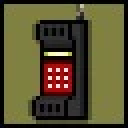
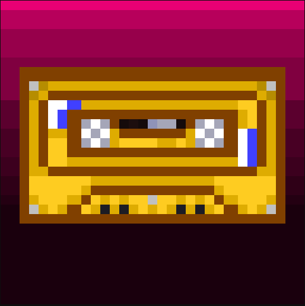
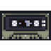

<!--
  Replace this placeholder with your real hero GIF at:
  assets/hero.gif

  The width is controlled here. GitHub preserves the GIF aspect ratio
  automatically when only width is specified.
-->

<!--
  GitHub profile READMEs cannot execute custom JavaScript or CSS hover behavior.
  The answering-machine menu below is static markup; true hover-based
  level-select behavior would require an external webpage.
-->

  

<table width="100%">
  <tr>
    <td width="140" align="center" valign="middle">
      
    </td>
    <td width="560" valign="top">
      <code>NEW MESSAGE [1/4]</code>
        
      My name is Dennis. 
      I build software around backend systems, 
      cloud infrastructure, security and automation.
        
      I do jobs at night.
    </td>
    <td width="120" valign="top">
      <code>&gt; PLAY</code> 
      <code>REWIND</code> 
      <code>FORWARD</code> 
      <code>DELETE</code> 
      <code>REPLY</code>
    </td>
  </tr>
</table>

  

<table width="100%">
  <tr>
    <td width="80" align="center" valign="middle">
      
    </td>
    <td width="330" valign="middle">
      <strong><a href="https://github.com/OloaneShark/Project_Blacklight">Project Blacklight</a></strong> 
      Open-source security tooling built around 
      modular and deterministic security checks.
    </td>
    <td width="80" align="center" valign="middle">
      
    </td>
    <td width="330" valign="middle">
      <strong><a href="https://github.com/OloaneShark/Middle_Man">Middle Man</a></strong> 
      Systems experimentation involving scheduling, 
      resource allocation, and inference infrastructure.
    </td>
  </tr>
</table>

  

<table width="100%">
  <tr>
    <td width="22%" valign="middle"><strong>Languages</strong></td>
    <td width="78%" valign="middle">
      Python &middot; TypeScript &middot; JavaScript &middot; SQL
    </td>
  </tr>
  <tr>
    <td width="22%" valign="middle"><strong>Cloud</strong></td>
    <td width="78%" valign="middle">
      AWS
    </td>
  </tr>
  <tr>
    <td width="22%" valign="middle"><strong>Infrastructure</strong></td>
    <td width="78%" valign="middle">
      Docker &middot; Linux &middot; PostgreSQL &middot; Git
    </td>
  </tr>
</table>

